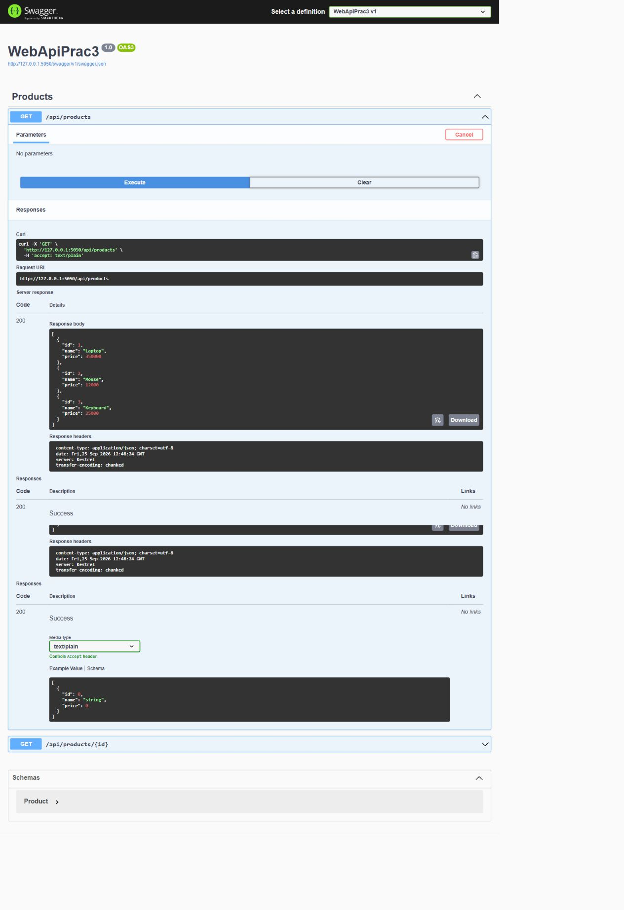
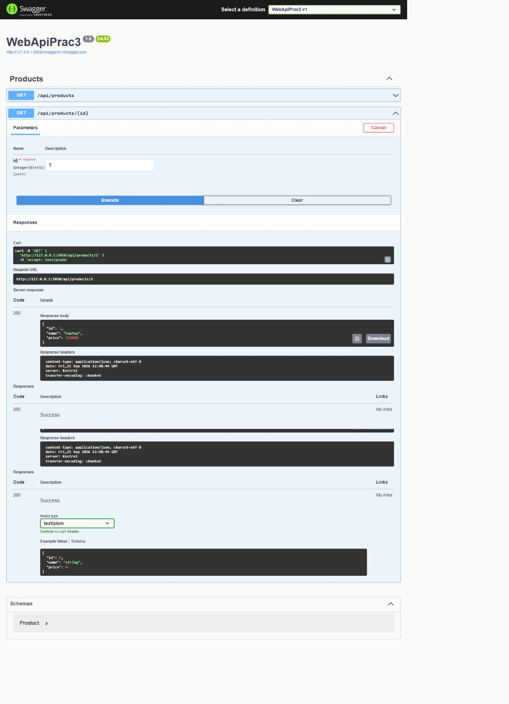
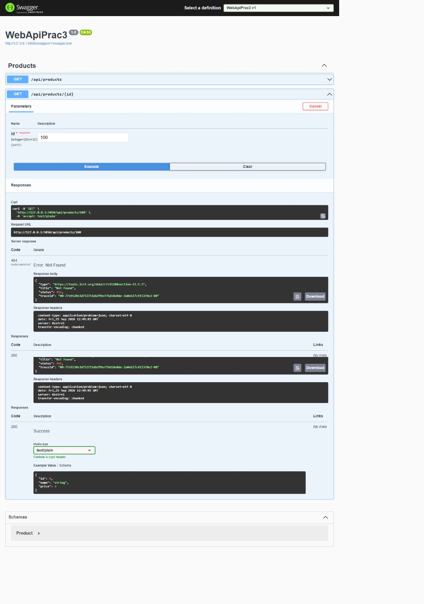

# WebApiPrac3 — Практическая работа 3

## Краткий отчёт

Создан ASP.NET Core Web API для получения списка товаров. В проекте использованы контроллер, сервисный слой, Dependency Injection, Swagger/OpenAPI и `ILogger`. Данные хранятся в `List<Product>` в памяти приложения; база данных не используется.

## Модель Product

Модель содержит три свойства: `Id`, `Name`, `Price`.

| Свойство | Тип | Описание |
|---|---|---|
| `Id` | `int` | Идентификатор товара |
| `Name` | `string` | Наименование товара |
| `Price` | `decimal` | Цена товара |

## Реализованные endpoints

| Метод | Endpoint | Назначение | Результат |
|---|---|---|---|
| GET | `/api/products` | Получить список всех товаров | `200 OK` |
| GET | `/api/products/{id}` | Получить товар по идентификатору | `200 OK` или `404 Not Found` |

## Пример JSON

```json
[
  {
    "id": 1,
    "name": "Laptop",
    "price": 350000
  },
  {
    "id": 2,
    "name": "Mouse",
    "price": 12000
  }
]
```

## Скриншоты выполнения

### GET `/api/products`



### GET `/api/products/1`



### GET `/api/products/100`



## Вывод

Контроллер получает `IProductService` и `ILogger<ProductsController>` через конструктор. Сервис зарегистрирован как `Scoped`, поэтому ASP.NET Core создаёт его через DI-контейнер для области HTTP-запроса. В `appsettings.json` установлен уровень `Warning`: информационные записи не выводятся, а предупреждения и ошибки выводятся.

## Ответы на контрольные вопросы

1. **Что такое Dependency Injection?** Это передача готовых зависимостей объекту извне, а не создание их внутри объекта.
2. **Какую проблему создаёт `new ProductService()` в контроллере?** Контроллер жёстко связан с конкретной реализацией; её сложнее заменить и тестировать.
3. **Для чего нужен `IProductService`?** Интерфейс отделяет контракт работы с товарами от реализации и позволяет подменять реализацию.
4. **Что такое Constructor Injection?** Это получение зависимостей через параметры конструктора.
5. **Зачем регистрировать сервис в `Program.cs`?** Так DI-контейнер знает, какую реализацию создавать для `IProductService`.
6. **Что делает `AddScoped`?** Регистрирует один экземпляр сервиса на один HTTP-запрос.
7. **Для чего используется `ILogger<T>`?** Для записи диагностических сообщений, предупреждений и ошибок с категорией указанного типа.
8. **В чём разница между Information, Warning и Error?** `Information` описывает обычный ход работы, `Warning` — необычную ситуацию, `Error` — ошибку, требующую внимания.
9. **Для чего используется `appsettings.json`?** Для хранения настроек приложения, включая уровни логирования.
10. **Почему слабосвязанный код проще изменять и тестировать?** Зависимость задаётся абстракцией, поэтому реализации можно менять или заменять тестовыми объектами без изменения контроллера.
